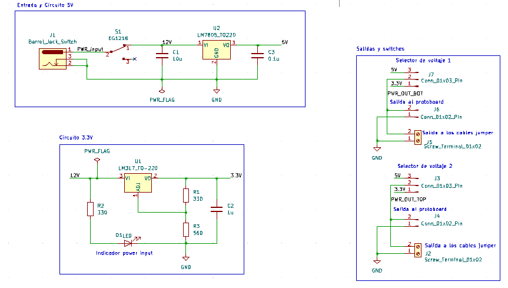

# P1 Protoboard Power Supply
Diseño de una fuente de poder para protoboard.
- Puede conectarse directamente a la protoboard
- On/Off switch
- Puede proveer 5V y 3.3V
- Puede usar voltajes de una variedad de fuentes de alimentación, desde 6 V hasta 12 V.

## Esquemático

## Layout

## PCB
