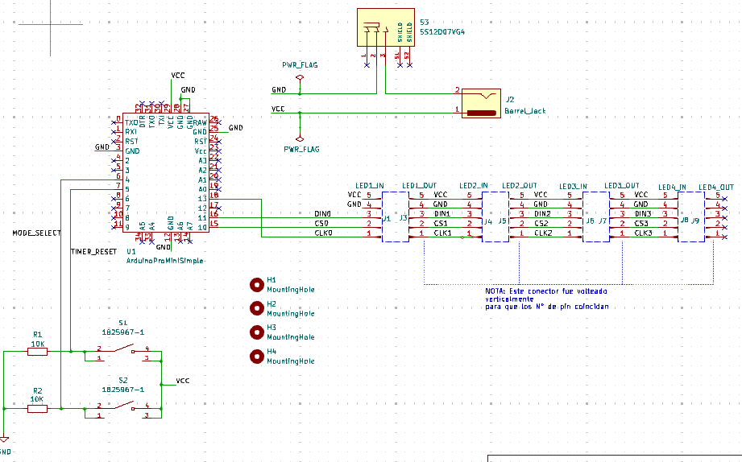
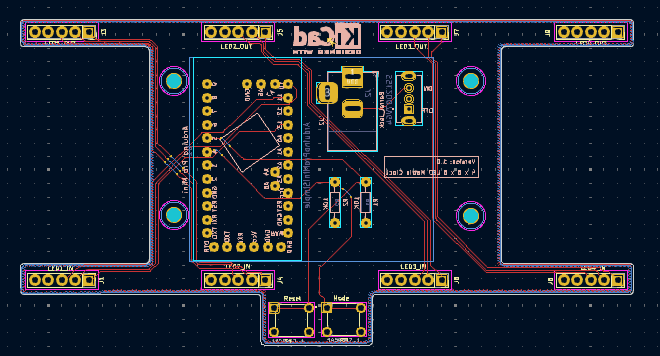
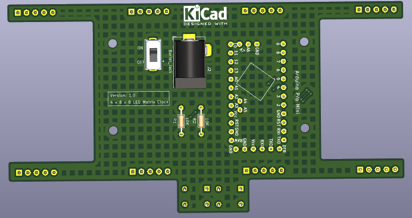

# P3 4x8x8 LED Matrix Clock
Diseño de PCB que puede tener cuatro pantallas de matriz LED de 8x8 controladas por un Arduino Pro
mini. 

La placa también incluye dos botones a los que se pueden asignar funciones arbitrarias.
Un posible uso puede ser un temporizador Pomodoro: Un botón para seleccionar la duración de la vuelta (por ejemplo, 15, 20 o 25 minutos) y el otro para reiniciar el temporizador. Cuando se acabe el tiempo establecido, la pantalla parpadeará para avisar.

## Esquemático

## Layout

## PCB

