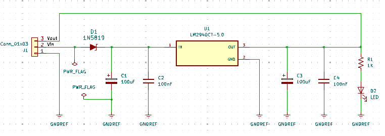
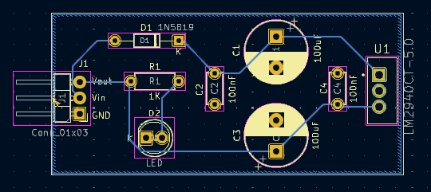

# P4 5V Voltage Regulator
Diseño de PCB para circuito regulador de 5V utilizando el regulador lineal LM2940.

- Voltaje de entrada: 7-35V DC

- Voltaje de salida regulado: 5V DC

## Esquemático

## Layout

## PCB
