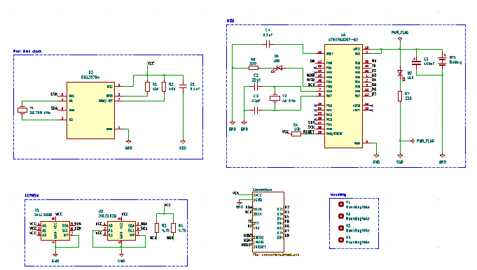
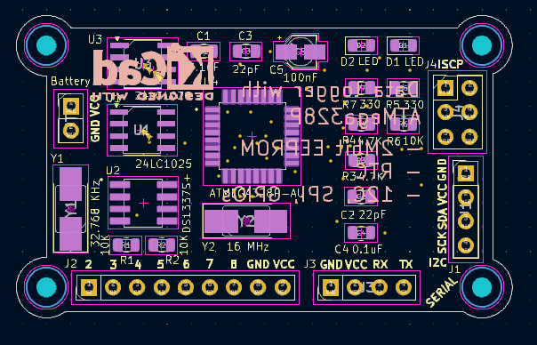

# P5 MCU Datalogger
Diseño de PCB para un datalogger con microcontrolador. El datalogger se basa en un microcontrolador Atmega 328P-AU y cuenta con dos EEPROMs y un reloj en tiempo real.
Componentes adicionales en la placa, como LEDs de estado con sus resistencias, dos osciladores de cristal, conectores y capacitores.

## Esquemático

## Layout

## PCB
