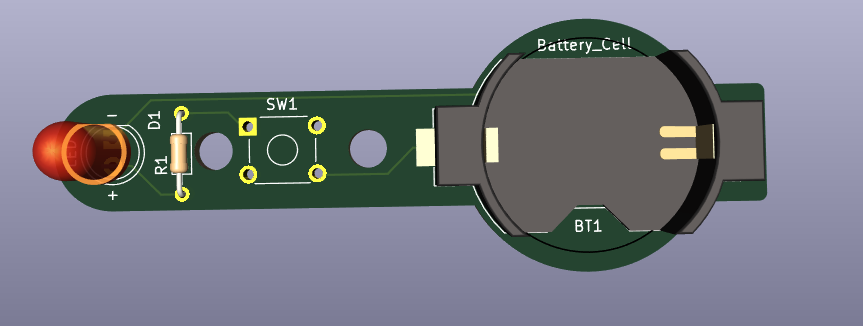
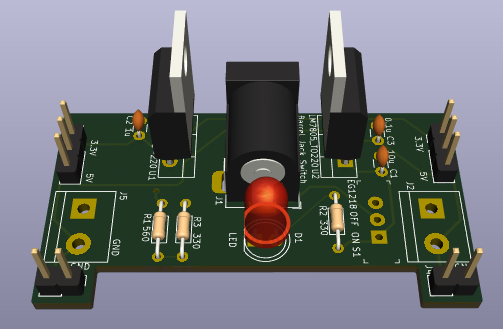
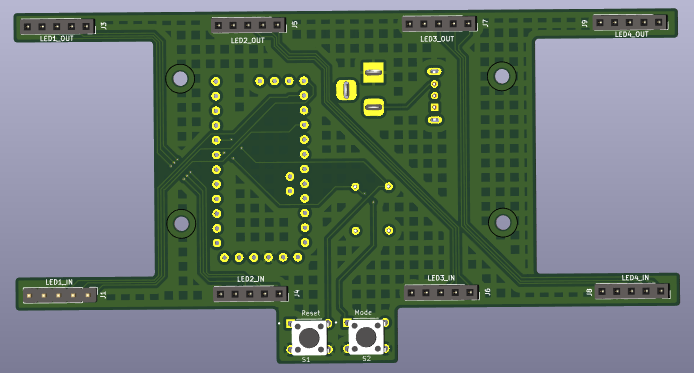
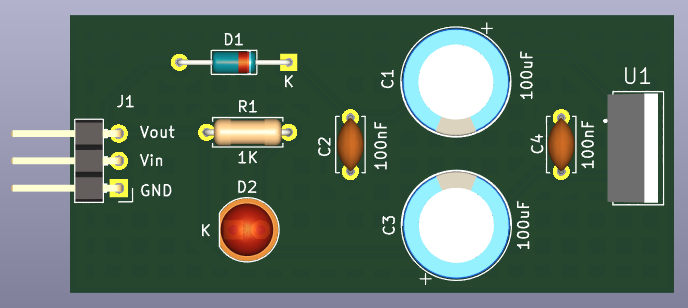
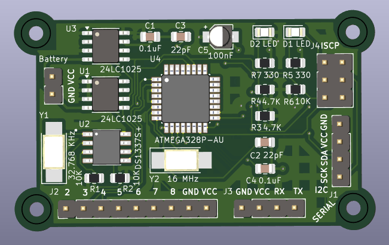

# KiCad-Proyectos
Repositorio con diseños de PCB usando KiCad 8.0

## Diseños PCB

- ### [P1 Linterna LED](./P1_LED_torch)

- ### [P2 Fuente de Poder para Protoboard](./P2_Protoboard_Power_Supply/)

- ### [P3 Reloj Matriz LED 4x8x8 ](./P3_4x8x8_LED_Matrix_Clock/)

- ### [P4 Regulador de Voltaje Lineal de 5V](./P4_Regulador_Voltaje_5V/)

- ### [P5 Datalogger con Microcontrolador](./P5_MCU_Datalogger/)
